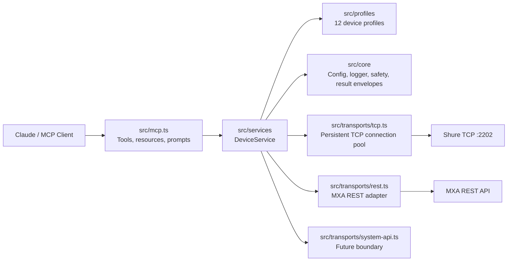

<p align="center">
  <a href="https://www.shure.com/">
    
  </a>
</p>

<h1 align="center">shure-mcp</h1>

<p align="center">
  <strong>Enterprise-grade local MCP server for guarded Shure installed-audio room operations, fleet monitoring, wireless management, and Dante network visibility.</strong>
</p>

<p align="center">
  <a href="#what-this-does">What It Does</a> |
  <a href="#quick-start">Quick Start</a> |
  <a href="#claude-integration">Claude Integration</a> |
  <a href="#examples">Examples</a> |
  <a href="#mcp-surface">MCP Surface</a> |
  <a href="#safety-model">Safety</a>
</p>

> This project is not affiliated with, sponsored by, or endorsed by Shure Incorporated.
> The Shure logo and Shure product names are trademarks of Shure Incorporated and are used here only to identify the device ecosystem this MCP server interoperates with.

## What This Does

`shure-mcp` lets Claude, MCP Inspector, and other Model Context Protocol clients interact with configured Shure networked audio devices from a local machine that can reach the Shure Control network.

It is designed around three jobs:

| Job | What it enables |
| --- | --- |
| Room operations | List rooms/devices, probe health, read status, mute/unmute, set gain, identify hardware, load presets, and inspect MXA talker positions. |
| Fleet monitoring | Parallel fleet health dashboard across all configured devices and rooms with per-device TCP/REST status, latency, firmware, and capability inventory. |
| Enterprise visibility | Per-channel audio metering, Dante/AES67 network status, and wireless receiver health (battery, RF frequency, signal strength) for QLX-D, ULX-D, and Axient Digital systems. |

The current implementation supports:

- Local MCP over `stdio`, suitable for Claude Desktop, Claude Code, MCP Inspector, and npm package delivery.
- Shure TCP command strings on port `2202`, using ASCII angle-bracket frames with no newline requirement.
- **Persistent TCP connection pool**: one socket per device, reused across serial commands, with a 30-second idle timeout — reduces handshake overhead from N-commands to 1-per-device for fleet operations.
- First-class profiles for `MXA920`, `MXA902`, `MXA910`, `MXA310`, `MXA710`, `P300`, `QLXD4D`, `ULXD4D`, `ULXD4Q`, `AD600`, `IntelliMix Room`, and `genericTcp`.
- MXA REST transport for MXA920, MXA902, and MXA710 when `restBaseUrl` is configured, with automatic TCP fallback.
- Guarded typed writes for ordinary operator actions: mute, gain, identify, and preset load.
- Raw TCP command execution behind a configurable safety policy.
- Structured JSON logging to stderr with configurable log level.
- Simulator-backed tests for TCP framing, REST normalization, MCP discovery, persistent connections, and guarded writes.
- A `SystemApiTransport` boundary for future Shure System API integration.

It does not currently do network discovery, cloud brokering, user authentication, Shure Designer project management, or remote HTTPS MCP hosting.

## Why MCP For Shure Rooms?

MCP gives assistants a structured way to use real tools instead of guessing from documentation. For AV and IT teams, that means a Claude conversation can become a controlled room operations surface:

- "Show me a fleet health dashboard for every Shure device across all rooms."
- "What are the battery levels on the wireless mics in the auditorium?"
- "Is Dante enabled on the boardroom MXA920, and what IP is it using for audio?"
- "Mute the P300 automixer output while we troubleshoot the far-end echo."
- "Flash the ceiling array so the onsite tech can identify the right MXA920."
- "Check whether talker positions are available before I wire camera tracking logic."
- "Read peak audio levels on channels 1 through 4 of the conference room MXA710."

The server keeps configuration, host allowlisting, transport health, typed capabilities, and safety decisions in code instead of pushing those details into every prompt.

## Architecture



Source layout:

| Layer | Path | Responsibility |
| --- | --- | --- |
| Core | `src/core` | Config loading, structured logger, normalized types, operation results, safety policy. |
| Profiles | `src/profiles` | Device capability/profile resolution for 12 Shure device types. |
| Transports | `src/transports` | Persistent TCP connection pool, MXA REST transport, future System API interface. |
| Services | `src/services` | Device/room orchestration, fleet health, audio metering, Dante status, wireless status, REST/TCP fallback. |
| MCP | `src/mcp.ts` | Public tools, resources, prompts, and deprecated aliases. |
| Simulator | `src/simulator` | TCP (multi-command persistent) and REST simulators used by tests. |
| Shure protocol | `src/shure` | Low-level command builders, TCP client, and frame parser. |

## Supported Device Profiles

| Profile | Transport | Capabilities |
| --- | --- | --- |
| `MXA920` | REST first, TCP fallback | Status, mute, gain, identify, presets, talker positions, audio metering, Dante. |
| `MXA902` | REST first, TCP fallback | Status, mute, gain, identify, presets, talker positions, audio metering, Dante. |
| `MXA910` | TCP | Status, mute, gain, identify, presets, audio metering, Dante. |
| `MXA710` | REST first, TCP fallback | Status, mute, gain, identify, presets, talker positions, audio metering, Dante. |
| `MXA310` | TCP | Status, mute, gain, identify, presets, audio metering, Dante. |
| `P300` | TCP | Status, automixer/device/channel mute, gain, identify, presets, audio metering, Dante. |
| `QLXD4D` | TCP | Status, mute, gain, identify, presets, audio metering, Dante, wireless (battery, RF). |
| `ULXD4D` | TCP | Status, mute, gain, identify, presets, audio metering, Dante, wireless (battery, RF). |
| `ULXD4Q` | TCP | Status, mute, gain, identify, presets, audio metering, Dante, wireless (battery, RF) for 4 channels. |
| `AD600` | TCP | Status, mute, gain, identify, presets, audio metering, Dante, wireless (battery, RF, interference). |
| `IntelliMix Room` | TCP | Status, mute, gain, identify, presets, audio metering, Dante. |
| `genericTcp` | TCP | Conservative command-string operations shared by many Shure installed-audio devices. |

Notes:

- MXA REST support depends on device firmware, settings, and the configured `restBaseUrl`.
- TCP command strings remain the broad compatibility layer across all profiles.
- Use the Shure Control IP address, not an audio-only Dante address.
- Wireless capabilities (battery, RF) require active transmitters to return meaningful values.

## Quick Start

Requirements:

- Node.js `>=20`
- Network reachability to the Shure Control IPs
- A JSON config file listing the devices this server is allowed to touch

Install and build:

```bash
npm install
npm run build
```

Create a local config:

```bash
cp examples/shure.config.example.json shure.config.local.json
```

Edit `shure.config.local.json` with real Shure Control IP addresses. Then run quality checks:

```bash
npm run typecheck
npm test
npm audit --omit=dev
```

Inspect the server with MCP Inspector:

```bash
SHURE_CONFIG_PATH=/Users/stella/shure-mcp/shure.config.local.json npm run inspect
```

Run the built stdio server:

```bash
SHURE_CONFIG_PATH=/Users/stella/shure-mcp/shure.config.local.json npm start
```

`npm start` launches a stdio MCP server. It waits for an MCP client and will look idle if you run it directly in a terminal.

## Claude Integration

This repo is ready for Claude in three practical ways. See [docs/claude.md](docs/claude.md) for the full setup guide.

### Claude Desktop

Build first:

```bash
npm install
npm run build
```

macOS config file:

```text
~/Library/Application Support/Claude/claude_desktop_config.json
```

Example:

```json
{
  "mcpServers": {
    "shure": {
      "command": "node",
      "args": ["/Users/stella/shure-mcp/dist/index.js"],
      "env": {
        "SHURE_CONFIG_PATH": "/Users/stella/shure-mcp/shure.config.local.json"
      }
    }
  }
}
```

Restart Claude Desktop and look for the `shure_*` tools.

### Claude Code

```bash
claude mcp add --transport stdio --scope local \
  --env SHURE_CONFIG_PATH=/Users/stella/shure-mcp/shure.config.local.json \
  shure -- node /Users/stella/shure-mcp/dist/index.js
```

Verify:

```bash
claude mcp list
claude mcp get shure
```

Inside Claude Code, run `/mcp` and confirm the server is connected.

### Claude Desktop MCPB Bundle

Package a one-click local MCP bundle:

```bash
npm run mcpb:pack
```

This creates:

```text
/Users/stella/shure-mcp/shure-mcp.mcpb
```

Install it in Claude Desktop:

1. Open Settings.
2. Open Extensions.
3. Choose Advanced settings.
4. Choose Install Extension.
5. Select `shure-mcp.mcpb`.
6. Enter the absolute path to your Shure config JSON.

The generated MCPB is unsigned by default, which is normal for local/internal testing.

### Optional Claude Skill

The repo includes a skill playbook that teaches Claude safe Shure room-operation behavior on top of the MCP tools:

```text
skills/shure-av-operator/SKILL.md
```

Package it:

```bash
npm run skill:pack
```

This creates:

```text
/Users/stella/shure-mcp/skills/shure-av-operator.zip
```

Upload that ZIP wherever your Claude environment supports custom skills. The skill is not a replacement for the MCP server; it is a workflow guide that tells Claude how to use the tools safely.

## Configuration

The preferred configuration path is `SHURE_CONFIG_PATH`, pointing at a JSON file:

```bash
SHURE_CONFIG_PATH=/Users/stella/shure-mcp/shure.config.local.json npm start
```

Full multi-room example with wireless and MXA devices:

```json
{
  "devices": [
    {
      "id": "boardroom-mxa920",
      "name": "Boardroom MXA920",
      "host": "192.168.1.50",
      "model": "MXA920",
      "room": "boardroom",
      "tags": ["ceiling-array", "camera-tracking"],
      "preferredApi": "auto",
      "tcpPort": 2202,
      "restBaseUrl": "https://192.168.1.50",
      "tls": "insecure"
    },
    {
      "id": "boardroom-p300",
      "name": "Boardroom P300",
      "host": "192.168.1.51",
      "model": "P300",
      "room": "boardroom",
      "tags": ["processor", "usb"],
      "preferredApi": "tcp",
      "tcpPort": 2202,
      "tls": "verify"
    },
    {
      "id": "auditorium-ulxd4q",
      "name": "Auditorium ULXD4Q",
      "host": "192.168.1.72",
      "model": "ULXD4Q",
      "room": "auditorium",
      "tags": ["wireless", "lavalier"],
      "preferredApi": "tcp",
      "tcpPort": 2202,
      "tls": "verify"
    }
  ],
  "rooms": [
    {
      "id": "boardroom",
      "name": "Boardroom",
      "deviceIds": ["boardroom-mxa920", "boardroom-p300"],
      "tags": ["zoom-room"]
    },
    {
      "id": "auditorium",
      "name": "Auditorium",
      "deviceIds": ["auditorium-ulxd4q"],
      "tags": ["large-venue", "wireless"]
    }
  ],
  "allowedHosts": ["192.168.1.50", "192.168.1.51", "192.168.1.72"],
  "safety": {
    "allowRawSet": false,
    "allowDestructive": false,
    "allowUnknownMutatingCommands": false
  },
  "timeouts": {
    "tcpMs": 2000,
    "restMs": 2500,
    "idleMs": 150
  },
  "logging": {
    "level": "info"
  }
}
```

See `examples/shure.config.example.json` for a complete seven-device, three-room example covering MXA920, P300, MXA710, MXA910, QLXD4D, and ULXD4Q.

Device fields:

| Field | Required | Notes |
| --- | --- | --- |
| `id` | Recommended | Stable identifier used in tool calls. If omitted, generated from name. |
| `name` | Recommended | Human-readable room/device label. |
| `host` | Yes | Shure Control IP or DNS name. Must pass allowlist checks when `allowedHosts` is set. |
| `model` | No | Helps select the profile before probing. Known values: `MXA920`, `MXA902`, `MXA910`, `MXA310`, `MXA710`, `P300`, `QLXD4D`, `ULXD4D`, `ULXD4Q`, `AD600`, `IntelliMixRoom`. |
| `room` | No | Room grouping. Rooms can also be declared explicitly in `rooms`. |
| `tags` | No | Operator metadata, for example `processor`, `camera-tracking`, `wireless`, `divisible-room`. |
| `preferredApi` | No | `auto`, `rest`, or `tcp`. Defaults to `auto`. |
| `tcpPort` | No | Defaults to Shure command-string port `2202`. |
| `restBaseUrl` | MXA REST only | Example: `https://192.168.1.50`. Required for REST-capable MXA devices. |
| `tls` | No | `verify` or `insecure`. `insecure` is useful for self-signed device certificates on trusted control networks. |

Environment variables remain available for compatibility:

| Variable | Purpose |
| --- | --- |
| `SHURE_CONFIG_PATH` | JSON config file with devices, rooms, safety, timeouts, and logging. |
| `SHURE_DEVICES` | Legacy JSON array of devices. |
| `SHURE_DEFAULT_HOST` | Creates a default device when no device list is configured. |
| `SHURE_DEFAULT_PORT` | Legacy TCP port override. Defaults to `2202`. |
| `SHURE_ALLOWED_HOSTS` | Comma-separated host allowlist. |
| `SHURE_TIMEOUT_MS` | TCP command timeout in milliseconds. |
| `SHURE_REST_TIMEOUT_MS` | REST timeout in milliseconds. |
| `SHURE_IDLE_MS` | TCP response idle window in milliseconds. |
| `SHURE_ALLOW_RAW_SET` | Allows known safe raw `SET` command strings. |
| `SHURE_ALLOW_DESTRUCTIVE` | Allows destructive operations such as reboot/reset. Default: blocked. |
| `SHURE_ALLOW_UNKNOWN_MUTATING_COMMANDS` | Allows unknown raw mutating command strings. Default: blocked. |

## Examples

### Fleet Health Dashboard

Ask Claude:

```text
Give me a fleet health dashboard for all Shure devices.
```

Tool:

```json
{
  "tool": "shure_fleet_health",
  "arguments": {}
}
```

Expected result shape:

```json
{
  "ok": true,
  "summary": "All 7 devices online.",
  "onlineCount": 7,
  "degradedCount": 0,
  "offlineCount": 0,
  "totalCount": 7,
  "durationMs": 312,
  "devices": [
    {
      "id": "boardroom-mxa920",
      "name": "Boardroom MXA920",
      "model": "MXA920",
      "room": "boardroom",
      "status": "online",
      "tcpOk": true,
      "restOk": true,
      "tcpLatencyMs": 18,
      "restLatencyMs": 42,
      "firmwareVersion": "6.6.1",
      "warnings": []
    }
  ],
  "rooms": [
    {
      "id": "boardroom",
      "name": "Boardroom",
      "allOnline": true,
      "deviceIds": ["boardroom-mxa920", "boardroom-p300"]
    }
  ]
}
```

### Wireless Battery and RF Status

Ask Claude:

```text
Check the battery and RF status on the auditorium wireless receiver, channel 1.
```

Tool:

```json
{
  "tool": "shure_get_wireless_status",
  "arguments": {
    "deviceId": "auditorium-ulxd4q",
    "channel": 1
  }
}
```

Expected result shape:

```json
{
  "ok": true,
  "data": {
    "channel": 1,
    "batteryCharge": "85",
    "rfFrequency": "655600",
    "rfPower": "NORMAL",
    "rfSignalStrength": "80",
    "transmitterType": "ULXD2"
  }
}
```

### Dante Network Status

Ask Claude:

```text
Show me the Dante configuration for the boardroom MXA920.
```

Tool:

```json
{
  "tool": "shure_get_dante_status",
  "arguments": {
    "deviceId": "boardroom-mxa920"
  }
}
```

Expected result shape:

```json
{
  "ok": true,
  "data": {
    "danteEnabled": "ON",
    "danteDeviceName": "MXA920-Boardroom",
    "danteAes67": "OFF",
    "audioIpAddr": "169.254.1.50",
    "audioSubnetMask": "255.255.0.0",
    "audioGateway": "0.0.0.0",
    "controlMacAddr": "AA:BB:CC:DD:EE:FF"
  }
}
```

### Peak Audio Levels

Ask Claude:

```text
Read peak audio levels for channels 1 through 4 on the boardroom MXA920.
```

Tool:

```json
{
  "tool": "shure_get_audio_levels",
  "arguments": {
    "deviceId": "boardroom-mxa920",
    "channels": [1, 2, 3, 4]
  }
}
```

Expected result shape:

```json
{
  "ok": true,
  "data": {
    "levels": [
      { "channel": 1, "rawLevel": "-300", "peakDb": -30.0 },
      { "channel": 2, "rawLevel": "-480", "peakDb": -48.0 },
      { "channel": 3, "rawLevel": "-600", "peakDb": -60.0 },
      { "channel": 4, "rawLevel": "-600", "peakDb": -60.0 }
    ]
  }
}
```

### List Inventory

Ask Claude:

```text
Use the Shure MCP server to list configured devices and rooms.
```

Tool:

```json
{
  "tool": "shure_list_devices",
  "arguments": {}
}
```

### Probe A Device

Ask Claude:

```text
Probe the boardroom MXA920 and tell me whether REST or TCP is available.
```

Tool:

```json
{
  "tool": "shure_probe_device",
  "arguments": { "deviceId": "boardroom-mxa920" }
}
```

### Run A Room Health Check

Ask Claude:

```text
Run a Shure room health check for the boardroom. Do not change room state.
```

Tool:

```json
{
  "tool": "shure_get_room_status",
  "arguments": { "roomId": "boardroom" }
}
```

### Mute A P300 Automixer Output

```json
{
  "tool": "shure_set_mute",
  "arguments": {
    "deviceId": "boardroom-p300",
    "target": "automixer",
    "state": "ON"
  }
}
```

For `automixer`, the implementation defaults to Shure channel index `21` when no index is provided.

### Set Channel Gain

```json
{
  "tool": "shure_set_gain",
  "arguments": {
    "deviceId": "boardroom-p300",
    "target": "channel",
    "index": 1,
    "gainDb": -6
  }
}
```

The server converts dB into Shure's raw high-resolution gain value for TCP command strings.

### Identify Hardware In The Room

```json
{
  "tool": "shure_identify_device",
  "arguments": {
    "deviceId": "boardroom-mxa920",
    "state": "ON"
  }
}
```

### Load A Preset

```json
{
  "tool": "shure_load_preset",
  "arguments": {
    "deviceId": "boardroom-mxa920",
    "preset": 2
  }
}
```

### Send A Guarded Raw TCP Command

```json
{
  "tool": "shure_send_tcp_command",
  "arguments": {
    "deviceId": "boardroom-p300",
    "command": "< GET DEVICE_ID >"
  }
}
```

Raw `GET` commands are allowed by default. Raw `SET`, reboot, reset, restore-defaults, and unknown mutating commands are blocked unless explicitly enabled by safety policy.

## MCP Surface

Canonical tools:

| Tool | Read/write | Purpose |
| --- | --- | --- |
| `shure_list_devices` | Read | List configured devices, rooms, profiles, and safety posture. |
| `shure_probe_device` | Read | Probe TCP/REST health, profile selection, model, firmware, and capabilities. |
| `shure_get_device_status` | Read | Return normalized status for one configured device. |
| `shure_get_room_status` | Read | Return normalized status for all devices in one room. |
| `shure_fleet_health` | Read | Parallel probe of all configured devices — fleet health dashboard with per-room summary. |
| `shure_get_audio_levels` | Read | Peak dBFS metering across specified channels via `AUDIO_IN_PEAK_LEVEL`. |
| `shure_get_dante_status` | Read | Dante/AES67 network status: enabled state, device name, IP addressing, AES67 mode. |
| `shure_get_wireless_status` | Read | Wireless receiver health: battery %, RF frequency, signal strength, TX type. |
| `shure_get_talker_positions` | Read | Read active talker positions from MXA REST-capable devices. |
| `shure_set_mute` | Write | Mute, unmute, or toggle device/channel/automixer/coverage-area targets. |
| `shure_set_gain` | Write | Set channel or coverage-area gain in dB. |
| `shure_identify_device` | Write | Turn the device identify/flash indicator on or off. |
| `shure_load_preset` | Write | Load preset `1` through `10`. |
| `shure_send_tcp_command` | Guarded raw | Send a documented Shure TCP command string through the safety policy. |

Deprecated compatibility aliases are kept for one release where practical:

- `shure_list_configured_devices`
- `shure_send_command`
- `shure_get_device_info`
- `shure_get_mute`
- `shure_get_audio_gain`
- `shure_set_audio_gain`

Resources:

| Resource | Purpose |
| --- | --- |
| `shure://devices` | Configured device inventory and profile summaries. |
| `shure://rooms/{roomId}` | Configured room definition. |
| `shure://devices/{deviceId}/capabilities` | Profile-derived device capabilities. |
| `shure://profiles/{model}` | Built-in profile metadata. |

Prompts:

| Prompt | Purpose |
| --- | --- |
| `shure_room_health_check` | Guide an operator through a room health review. |
| `shure_mute_sync_diagnosis` | Diagnose mute sync across processors, microphones, and conferencing software. |
| `shure_camera_tracking_setup` | Assess MXA talker-position and camera-tracking readiness. |
| `shure_safe_tcp_command` | Evaluate and run a documented TCP command through guardrails. |
| `shure_fleet_briefing` | Generate a concise executive-ready fleet health briefing across all rooms. |
| `shure_wireless_readiness` | Pre-event battery and RF readiness check across all wireless receivers. |

## Safety Model

Safety is deliberately conservative.

Reads are available when a device is configured and host allowlisting permits access.

Typed writes are available for normal room operations:

- mute, unmute, toggle
- gain changes
- identify LED
- preset load

Raw TCP command strings are guarded:

- Raw `GET` commands are allowed by default.
- Raw `SET` commands are blocked unless `allowRawSet` is enabled.
- Destructive commands such as `REBOOT`, `DEFAULT_SETTINGS`, reset, and restore variants are blocked unless `allowDestructive` is enabled.
- Unknown raw mutating commands are blocked unless `allowUnknownMutatingCommands` is enabled.

Every operation result is structured with:

- `ok`
- `operation`
- `deviceId`
- `transport`
- `durationMs`
- parsed TCP frames where applicable
- warnings
- remediation hints
- error code/message when something fails

Example blocked raw command outcome:

```json
{
  "ok": false,
  "operation": "rawTcp.write",
  "deviceId": "boardroom-p300",
  "warnings": [],
  "remediation": [
    "Use typed tools for guarded writes or explicitly enable raw SET/destructive policy in config."
  ],
  "error": {
    "code": "SAFETY_BLOCKED",
    "message": "Raw SET commands are blocked by guarded write policy. Use typed tools or enable allowRawSet."
  }
}
```

## Transport Behavior

TCP behavior:

- Connects to the configured device host and `tcpPort`, defaulting to `2202`.
- Maintains a **persistent socket pool** — one connection per device host:port, reused across all serial commands.
- Idle sockets are closed automatically after 30 seconds of inactivity.
- Commands are serialized per device (no concurrent writes on the same socket).
- Sends Shure command strings exactly as angle-bracket frames, with no newline delimiter.
- Parses one or more returned frames per command.
- Supports no-acknowledgement commands with explicit `waitForResponse: false`.

REST behavior:

- Used for MXA profiles when `preferredApi` is `auto` or `rest` and `restBaseUrl` is configured.
- Normalizes supported MXA status, mute, preset, and talker-position responses.
- Falls back to TCP where the profile and operation support it.
- Supports `tls: "insecure"` for trusted networks with self-signed device certificates.

Logging:

- All log output goes to `stderr` as newline-delimited JSON: `{ "ts": "...", "level": "info", "msg": "..." }`.
- Configurable via `logging.level` in the config file: `silent`, `error`, `warn`, `info`, `debug`.

## Development

Common commands:

```bash
npm run build
npm run typecheck
npm test
npm audit --omit=dev
npm run inspect
npm run mcpb:validate
npm run mcpb:pack
npm run skill:validate
npm run skill:pack
```

Current test coverage includes:

- config-file and legacy environment loading
- host allowlisting
- safety policy decisions
- device profile selection and fallback for 12 profiles
- Shure TCP frame parsing
- no-newline TCP exchanges
- no-acknowledgement commands
- dB to raw Shure gain conversion
- MXA REST response normalization
- simulator-backed probing, REST/TCP fallback, and persistent connection multi-command sessions
- MCP tool/resource/prompt discovery
- Claude integration examples and skill metadata

## Troubleshooting

| Symptom | Likely cause | Fix |
| --- | --- | --- |
| Claude does not show `shure_*` tools | MCP server not configured, not built, or Claude Desktop not restarted. | Run `npm run build`, verify the absolute `dist/index.js` path, restart Claude. |
| `Host ... is not in allowedHosts` | Config host is not allowlisted. | Add the exact host/IP to `allowedHosts` or `SHURE_ALLOWED_HOSTS`. |
| TCP probe times out | Wrong IP, firewall, wrong VLAN, device offline, or using Dante-only IP. | Use the Shure Control IP and confirm port `2202` reachability. |
| REST probe fails but TCP works | MXA REST not enabled/reachable, missing `restBaseUrl`, certificate issue, or unsupported firmware. | Configure `restBaseUrl`, check firmware/settings, use `tls: "insecure"` only on trusted networks if needed. |
| Raw command is blocked | Safety policy is doing its job. | Prefer typed tools. Enable raw mutating commands only for trusted operators. |
| Gain value looks unfamiliar | Shure TCP uses raw high-resolution gain values. | Use `shure_set_gain` with `gainDb`; the server converts it. |
| Wireless status returns all undefined | No active transmitters on the receiver, or device does not support wireless TCP params. | Power on transmitters and verify this is a QLX-D, ULX-D, or Axient Digital receiver. |
| `node dist/index.js` appears to hang | Stdio MCP servers wait for MCP client traffic. | Use Claude, MCP Inspector, or an SDK client to connect. |

## Packaging

NPM package dry run:

```bash
npm pack --dry-run
```

Claude Desktop MCPB:

```bash
npm run mcpb:pack
```

Claude skill ZIP:

```bash
npm run skill:pack
```

Generated artifacts are ignored by git:

- `shure-mcp.mcpb`
- `skills/shure-av-operator.zip`
- `*.tgz`

## Roadmap

High-value next steps:

- Harden MXA REST endpoint mapping against real-device fixtures from multiple firmware versions.
- Add TCP `SAMPLE` subscription support for push-based audio metering and talker-position streams.
- Add optional Streamable HTTP transport for hosted/internal service deployments.
- Add authenticated enterprise fleet workflows through the `SystemApiTransport` boundary (Shure System API Server).
- Add richer room-level policy: write windows, role-based command categories, and audit logging.
- Add fixture packs from real rooms while keeping live device details out of source control.

## References

Official Shure references:

- [Shure home page and logo source](https://www.shure.com/)
- [Official Shure logo asset used in this README](https://shure.widen.net/content/t0w379jsk1/png/Shure%20Logo.png)
- [Shure command strings](https://www.shure.com/en-US/docs/commandstrings/)
- [MXA920 command strings](https://www.shure.com/en-US/docs/commandstrings/MXA920/)
- [P300 command strings](https://www.shure.com/en-US/docs/commandstrings/P300/)
- [MXA920 user guide](https://www.shure.com/en-US/docs/guide/MXA920/)
- [Shure REST API hub](https://shure.stoplight.io/)

MCP and Claude references:

- [Model Context Protocol overview](https://modelcontextprotocol.io/docs/getting-started/intro)
- [MCP Inspector](https://modelcontextprotocol.io/docs/tools/inspector)
- [Claude MCPB packaging](https://claude.com/docs/connectors/building/mcpb)
- [Claude custom skills](https://claude.com/docs/skills/how-to)
