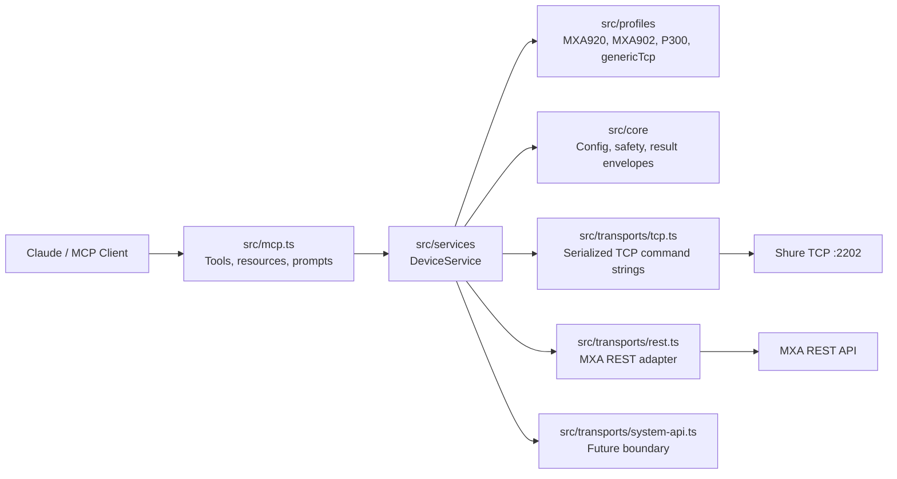

<p align="center">
  <a href="https://www.shure.com/">
    
  </a>
</p>

<h1 align="center">shure-mcp</h1>

<p align="center">
  <strong>Unofficial local MCP server for guarded Shure installed-audio room operations and fleet-ready monitoring.</strong>
</p>

<p align="center">
  <a href="#what-this-does">What It Does</a> |
  <a href="#quick-start">Quick Start</a> |
  <a href="#claude-integration">Claude Integration</a> |
  <a href="#examples">Examples</a> |
  <a href="#mcp-surface">MCP Surface</a> |
  <a href="#safety-model">Safety</a>
</p>

> This project is not affiliated with, sponsored by, or endorsed by Shure Incorporated.
> The Shure logo and Shure product names are trademarks of Shure Incorporated and are used here only to identify the device ecosystem this MCP server interoperates with.

## What This Does

`shure-mcp` lets Claude, MCP Inspector, and other Model Context Protocol clients interact with configured Shure networked audio devices from a local machine that can reach the Shure Control network.

It is designed around two jobs:

| Job | What it enables |
| --- | --- |
| Room operations | List rooms/devices, probe health, read status, mute/unmute, set gain, identify hardware, load presets, and inspect MXA talker positions. |
| Fleet readiness | Normalize device inventory, capabilities, transport health, rooms, safety policy, and prompts so the server can grow into broader enterprise workflows. |

The current implementation supports:

- Local MCP over `stdio`, suitable for Claude Desktop, Claude Code, MCP Inspector, and npm package delivery.
- Shure TCP command strings on port `2202`, using ASCII angle-bracket frames with no newline requirement.
- First-class profiles for `MXA920`, `MXA902`, `P300`, and `genericTcp`.
- MXA REST transport support when `restBaseUrl` is configured and the device responds, with TCP fallback for common operations.
- Guarded typed writes for ordinary operator actions such as mute, gain, identify, and preset load.
- Raw TCP command execution behind a safety policy.
- Simulator-backed tests for TCP framing, REST normalization, MCP discovery, and guarded writes.
- A placeholder `SystemApiTransport` boundary for future Shure System API support.

It does not currently do network discovery, cloud brokering, user authentication, Shure Designer project management, or remote HTTPS MCP hosting. v1 is intentionally local, explicit, and safety-first.

## Why MCP For Shure Rooms?

MCP gives assistants a structured way to use real tools instead of guessing from documentation. For AV and IT teams, that means a Claude conversation can become a controlled room operations surface:

- "Show me every Shure device in the boardroom and whether TCP or REST is healthy."
- "Mute the P300 automixer output while we troubleshoot the far-end echo."
- "Flash the ceiling array so the onsite tech can identify the right MXA920."
- "Check whether talker positions are available before I wire camera tracking logic."
- "Run this documented Shure `GET` command and explain the response."

The server keeps configuration, host allowlisting, transport health, typed capabilities, and safety decisions in code instead of pushing those details into every prompt.

## Architecture



Source layout:

| Layer | Path | Responsibility |
| --- | --- | --- |
| Core | `src/core` | Config loading, normalized types, operation results, safety policy. |
| Profiles | `src/profiles` | Device capability/profile resolution for MXA920, MXA902, P300, and generic TCP devices. |
| Transports | `src/transports` | TCP command transport, MXA REST transport, future System API interface. |
| Services | `src/services` | Device/room orchestration, probing, REST/TCP fallback, typed operations. |
| MCP | `src/mcp.ts` | Public tools, resources, prompts, and deprecated aliases. |
| Simulator | `src/simulator` | TCP and REST simulators used by tests. |
| Shure protocol | `src/shure` | Low-level command builders, TCP client, and frame parser. |

## Supported Device Profiles

| Profile | Transport preference | Supported today |
| --- | --- | --- |
| `MXA920` | REST first when configured, TCP fallback | Status, mute, gain, identify, presets, talker-position reads, raw documented TCP. |
| `MXA902` | REST first when configured, TCP fallback | Status, mute, gain, identify, presets, talker-position reads, raw documented TCP. |
| `P300` | TCP | Status, automixer/device/channel mute, gain, identify, presets, raw documented TCP. |
| `genericTcp` | TCP | Conservative command-string operations shared by many Shure installed-audio devices. |

Notes:

- MXA REST support depends on device firmware, settings, and the configured `restBaseUrl`.
- TCP command strings remain the broad compatibility layer.
- Use the Shure Control IP address, not an audio-only Dante address.

## Quick Start

Requirements:

- Node.js `>=20`
- Network reachability to the Shure Control IPs
- A JSON config file listing the devices this server is allowed to touch

Install and build:

```bash
npm install
npm run build
```

Create a local config:

```bash
cp examples/shure.config.example.json shure.config.local.json
```

Edit `shure.config.local.json` with real Shure Control IP addresses. Then run quality checks:

```bash
npm run typecheck
npm test
npm audit --omit=dev
```

Inspect the server with MCP Inspector:

```bash
SHURE_CONFIG_PATH=/Users/stella/shure-mcp/shure.config.local.json npm run inspect
```

Run the built stdio server:

```bash
SHURE_CONFIG_PATH=/Users/stella/shure-mcp/shure.config.local.json npm start
```

`npm start` launches a stdio MCP server. It waits for an MCP client and will look idle if you run it directly in a terminal.

## Claude Integration

This repo is ready for Claude in three practical ways. See [docs/claude.md](docs/claude.md) for the full setup guide.

### Claude Desktop

Build first:

```bash
npm install
npm run build
```

macOS config file:

```text
~/Library/Application Support/Claude/claude_desktop_config.json
```

Example:

```json
{
  "mcpServers": {
    "shure": {
      "command": "node",
      "args": ["/Users/stella/shure-mcp/dist/index.js"],
      "env": {
        "SHURE_CONFIG_PATH": "/Users/stella/shure-mcp/shure.config.local.json"
      }
    }
  }
}
```

Restart Claude Desktop and look for the `shure_*` tools.

### Claude Code

```bash
claude mcp add --transport stdio --scope local \
  --env SHURE_CONFIG_PATH=/Users/stella/shure-mcp/shure.config.local.json \
  shure -- node /Users/stella/shure-mcp/dist/index.js
```

Verify:

```bash
claude mcp list
claude mcp get shure
```

Inside Claude Code, run `/mcp` and confirm the server is connected.

### Claude Desktop MCPB Bundle

Package a one-click local MCP bundle:

```bash
npm run mcpb:pack
```

This creates:

```text
/Users/stella/shure-mcp/shure-mcp.mcpb
```

Install it in Claude Desktop:

1. Open Settings.
2. Open Extensions.
3. Choose Advanced settings.
4. Choose Install Extension.
5. Select `shure-mcp.mcpb`.
6. Enter the absolute path to your Shure config JSON.

The generated MCPB is unsigned by default, which is normal for local/internal testing.

### Optional Claude Skill

The repo includes a skill playbook that teaches Claude safe Shure room-operation behavior on top of the MCP tools:

```text
skills/shure-av-operator/SKILL.md
```

Package it:

```bash
npm run skill:pack
```

This creates:

```text
/Users/stella/shure-mcp/skills/shure-av-operator.zip
```

Upload that ZIP wherever your Claude environment supports custom skills. The skill is not a replacement for the MCP server; it is a workflow guide that tells Claude how to use the tools safely.

## Configuration

The preferred configuration path is `SHURE_CONFIG_PATH`, pointing at a JSON file:

```bash
SHURE_CONFIG_PATH=/Users/stella/shure-mcp/shure.config.local.json npm start
```

Example room with an MXA920 and P300:

```json
{
  "devices": [
    {
      "id": "boardroom-mxa920",
      "name": "Boardroom MXA920",
      "host": "192.168.1.50",
      "model": "MXA920",
      "room": "boardroom",
      "tags": ["ceiling-array", "camera-tracking"],
      "preferredApi": "auto",
      "tcpPort": 2202,
      "restBaseUrl": "https://192.168.1.50",
      "tls": "insecure"
    },
    {
      "id": "boardroom-p300",
      "name": "Boardroom P300",
      "host": "192.168.1.51",
      "model": "P300",
      "room": "boardroom",
      "tags": ["processor", "usb"],
      "preferredApi": "tcp",
      "tcpPort": 2202,
      "tls": "verify"
    }
  ],
  "rooms": [
    {
      "id": "boardroom",
      "name": "Boardroom",
      "deviceIds": ["boardroom-mxa920", "boardroom-p300"],
      "tags": ["zoom-room"]
    }
  ],
  "allowedHosts": ["192.168.1.50", "192.168.1.51"],
  "safety": {
    "allowRawSet": false,
    "allowDestructive": false,
    "allowUnknownMutatingCommands": false
  },
  "timeouts": {
    "tcpMs": 2000,
    "restMs": 2500,
    "idleMs": 150
  },
  "logging": {
    "level": "warn"
  }
}
```

Device fields:

| Field | Required | Notes |
| --- | --- | --- |
| `id` | Recommended | Stable identifier used in tool calls. If omitted, generated from name. |
| `name` | Recommended | Human-readable room/device label. |
| `host` | Yes | Shure Control IP or DNS name. Must pass allowlist checks when `allowedHosts` is set. |
| `model` | No | Helps select the profile before probing. Known values include `MXA920`, `MXA902`, `P300`, `genericTcp`. |
| `room` | No | Room grouping. Rooms can also be declared explicitly in `rooms`. |
| `tags` | No | Operator metadata, for example `processor`, `camera-tracking`, `divisible-room`. |
| `preferredApi` | No | `auto`, `rest`, or `tcp`. Defaults to `auto`. |
| `tcpPort` | No | Defaults to Shure command-string port `2202`. |
| `restBaseUrl` | MXA REST only | Example: `https://192.168.1.50`. |
| `tls` | No | `verify` or `insecure`. `insecure` is useful for self-signed device certificates on trusted control networks. |

Environment variables remain available for compatibility:

| Variable | Purpose |
| --- | --- |
| `SHURE_CONFIG_PATH` | JSON config file with devices, rooms, safety, timeouts, and logging. |
| `SHURE_DEVICES` | Legacy JSON array of devices. |
| `SHURE_DEFAULT_HOST` | Creates a default device when no device list is configured. |
| `SHURE_DEFAULT_PORT` | Legacy TCP port override. Defaults to `2202`. |
| `SHURE_ALLOWED_HOSTS` | Comma-separated host allowlist. |
| `SHURE_TIMEOUT_MS` | TCP command timeout in milliseconds. |
| `SHURE_REST_TIMEOUT_MS` | REST timeout in milliseconds. |
| `SHURE_IDLE_MS` | TCP response idle window in milliseconds. |
| `SHURE_ALLOW_RAW_SET` | Allows known safe raw `SET` command strings. |
| `SHURE_ALLOW_DESTRUCTIVE` | Allows destructive operations such as reboot/reset. Default: blocked. |
| `SHURE_ALLOW_UNKNOWN_MUTATING_COMMANDS` | Allows unknown raw mutating command strings. Default: blocked. |

## Examples

These examples show the kind of requests you can make from Claude, plus the underlying tool shape when useful.

### List Inventory

Ask Claude:

```text
Use the Shure MCP server to list configured devices and rooms.
```

Tool:

```json
{
  "tool": "shure_list_devices",
  "arguments": {}
}
```

Expected result shape:

```json
{
  "devices": [
    {
      "device": {
        "id": "boardroom-mxa920",
        "name": "Boardroom MXA920",
        "host": "192.168.1.50",
        "model": "MXA920",
        "room": "boardroom"
      },
      "profile": {
        "model": "MXA920",
        "prefersRest": true
      }
    }
  ],
  "rooms": [
    {
      "id": "boardroom",
      "name": "Boardroom"
    }
  ],
  "safety": {
    "allowRawSet": false,
    "allowDestructive": false,
    "allowUnknownMutatingCommands": false
  }
}
```

### Probe A Device

Ask Claude:

```text
Probe the boardroom MXA920 and tell me whether REST or TCP is available.
```

Tool:

```json
{
  "tool": "shure_probe_device",
  "arguments": {
    "deviceId": "boardroom-mxa920"
  }
}
```

The response includes profile selection, model/firmware data when available, TCP health, REST health, warnings, and capabilities.

### Run A Room Health Check

Ask Claude:

```text
Run a Shure room health check for the boardroom. Do not change room state.
```

Tool:

```json
{
  "tool": "shure_get_room_status",
  "arguments": {
    "roomId": "boardroom"
  }
}
```

Useful when opening a support ticket or validating a room after firmware/network work.

### Mute A P300 Automixer Output

Ask Claude:

```text
Mute the boardroom P300 automixer output.
```

Tool:

```json
{
  "tool": "shure_set_mute",
  "arguments": {
    "deviceId": "boardroom-p300",
    "target": "automixer",
    "state": "ON"
  }
}
```

For `automixer`, the implementation defaults to Shure channel index `21` when no index is provided.

### Unmute A Device

Ask Claude:

```text
Unmute the boardroom MXA920.
```

Tool:

```json
{
  "tool": "shure_set_mute",
  "arguments": {
    "deviceId": "boardroom-mxa920",
    "target": "device",
    "state": "OFF"
  }
}
```

### Set Channel Gain

Ask Claude:

```text
Set channel 1 gain on the boardroom P300 to -6 dB.
```

Tool:

```json
{
  "tool": "shure_set_gain",
  "arguments": {
    "deviceId": "boardroom-p300",
    "target": "channel",
    "index": 1,
    "gainDb": -6
  }
}
```

The server converts dB into Shure's raw high-resolution gain value for TCP command strings.

### Identify Hardware In The Room

Ask Claude:

```text
Flash the identify light on the boardroom MXA920 so the onsite tech can find it.
```

Tool:

```json
{
  "tool": "shure_identify_device",
  "arguments": {
    "deviceId": "boardroom-mxa920",
    "state": "ON"
  }
}
```

Turn it off afterward:

```json
{
  "tool": "shure_identify_device",
  "arguments": {
    "deviceId": "boardroom-mxa920",
    "state": "OFF"
  }
}
```

### Load A Preset

Ask Claude:

```text
Load preset 2 on the boardroom MXA920.
```

Tool:

```json
{
  "tool": "shure_load_preset",
  "arguments": {
    "deviceId": "boardroom-mxa920",
    "preset": 2
  }
}
```

Preset numbers are intentionally constrained from `1` through `10`.

### Read Talker Positions

Ask Claude:

```text
Check whether the MXA920 is returning talker positions for camera tracking.
```

Tool:

```json
{
  "tool": "shure_get_talker_positions",
  "arguments": {
    "deviceId": "boardroom-mxa920"
  }
}
```

Talker positions require an MXA REST-capable device and a reachable `restBaseUrl`.

### Send A Guarded Raw TCP Command

Ask Claude:

```text
Send a safe documented Shure GET command to read the boardroom P300 device ID.
```

Tool:

```json
{
  "tool": "shure_send_tcp_command",
  "arguments": {
    "deviceId": "boardroom-p300",
    "command": "< GET DEVICE_ID >"
  }
}
```

Raw `GET` commands are allowed by default. Raw `SET`, reboot, reset, restore-defaults, and unknown mutating commands are blocked unless explicitly enabled by safety policy.

## MCP Surface

Canonical tools:

| Tool | Read/write | Purpose |
| --- | --- | --- |
| `shure_list_devices` | Read | List configured devices, rooms, profiles, and safety posture. |
| `shure_probe_device` | Read | Probe TCP/REST health, profile selection, model, firmware, and capabilities. |
| `shure_get_device_status` | Read | Return normalized status for one configured device. |
| `shure_get_room_status` | Read | Return normalized status for all devices in one room. |
| `shure_set_mute` | Write | Mute, unmute, or toggle device/channel/automixer/coverage-area targets. |
| `shure_set_gain` | Write | Set channel or coverage-area gain in dB. |
| `shure_identify_device` | Write | Turn the device identify/flash indicator on or off. |
| `shure_load_preset` | Write | Load preset `1` through `10`. |
| `shure_get_talker_positions` | Read | Read active talker positions from MXA REST-capable devices. |
| `shure_send_tcp_command` | Guarded raw | Send a documented Shure TCP command string through the safety policy. |

Deprecated compatibility aliases are kept for one release where practical:

- `shure_list_configured_devices`
- `shure_send_command`
- `shure_get_device_info`
- `shure_get_mute`
- `shure_get_audio_gain`
- `shure_set_audio_gain`

Resources:

| Resource | Purpose |
| --- | --- |
| `shure://devices` | Configured device inventory and profile summaries. |
| `shure://rooms/{roomId}` | Configured room definition. |
| `shure://devices/{deviceId}/capabilities` | Profile-derived device capabilities. |
| `shure://profiles/{model}` | Built-in profile metadata. |

Prompts:

| Prompt | Purpose |
| --- | --- |
| `shure_room_health_check` | Guide an operator through a room health review. |
| `shure_mute_sync_diagnosis` | Diagnose mute sync across processors, microphones, and conferencing software. |
| `shure_camera_tracking_setup` | Assess MXA talker-position and camera-tracking readiness. |
| `shure_safe_tcp_command` | Evaluate and run a documented TCP command through guardrails. |

## Safety Model

Safety is deliberately conservative.

Reads are available when a device is configured and host allowlisting permits access.

Typed writes are available for normal room operations:

- mute, unmute, toggle
- gain changes
- identify LED
- preset load

Raw TCP command strings are guarded:

- Raw `GET` commands are allowed by default.
- Raw `SET` commands are blocked unless `allowRawSet` is enabled.
- Destructive commands such as `REBOOT`, `DEFAULT_SETTINGS`, reset, and restore variants are blocked unless `allowDestructive` is enabled.
- Unknown raw mutating commands are blocked unless `allowUnknownMutatingCommands` is enabled.

Every operation result is structured with:

- `ok`
- `operation`
- `deviceId`
- `transport`
- `durationMs`
- parsed TCP frames where applicable
- warnings
- remediation hints
- error code/message when something fails

Example blocked raw command outcome:

```json
{
  "ok": false,
  "operation": "rawTcp.write",
  "deviceId": "boardroom-p300",
  "warnings": [
    "Raw SET commands are disabled by safety policy."
  ],
  "remediation": [
    "Use a typed tool such as shure_set_mute or explicitly enable SHURE_ALLOW_RAW_SET for trusted operators."
  ],
  "error": {
    "code": "SAFETY_BLOCKED",
    "message": "Raw SET commands are disabled by safety policy."
  }
}
```

## Transport Behavior

TCP behavior:

- Connects to the configured device host and `tcpPort`, defaulting to `2202`.
- Sends Shure command strings exactly as angle-bracket frames.
- Does not append newline delimiters.
- Parses one or more returned frames.
- Serializes per-device TCP execution so async reports and sample traffic are easier to reason about.
- Supports no-acknowledgement commands with explicit `waitForResponse: false`.

REST behavior:

- Used for MXA profiles when `preferredApi` is `auto` or `rest` and `restBaseUrl` is configured.
- Normalizes supported MXA status, mute, preset, and talker-position responses.
- Falls back to TCP where the profile and operation support it.
- Supports `tls: "insecure"` for trusted networks with self-signed device certificates.

## Development

Common commands:

```bash
npm run build
npm run typecheck
npm test
npm audit --omit=dev
npm run inspect
npm run mcpb:validate
npm run mcpb:pack
npm run skill:validate
npm run skill:pack
```

Current test coverage includes:

- config-file and legacy environment loading
- host allowlisting
- safety policy decisions
- device profile selection
- Shure TCP frame parsing
- no-newline TCP exchanges
- no-acknowledgement commands
- dB to raw Shure gain conversion
- MXA REST response normalization
- simulator-backed probing and REST/TCP fallback
- MCP tool/resource/prompt discovery
- Claude integration examples and skill metadata

## Troubleshooting

| Symptom | Likely cause | Fix |
| --- | --- | --- |
| Claude does not show `shure_*` tools | MCP server not configured, not built, or Claude Desktop not restarted. | Run `npm run build`, verify the absolute `dist/index.js` path, restart Claude. |
| `Host ... is not in allowedHosts` | Config host is not allowlisted. | Add the exact host/IP to `allowedHosts` or `SHURE_ALLOWED_HOSTS`. |
| TCP probe times out | Wrong IP, firewall, wrong VLAN, device offline, or using Dante-only IP. | Use the Shure Control IP and confirm port `2202` reachability. |
| REST probe fails but TCP works | MXA REST not enabled/reachable, missing `restBaseUrl`, certificate issue, or unsupported firmware. | Configure `restBaseUrl`, check firmware/settings, use `tls: "insecure"` only on trusted networks if needed. |
| Raw command is blocked | Safety policy is doing its job. | Prefer typed tools. Enable raw mutating commands only for trusted operators. |
| Gain value looks unfamiliar | Shure TCP uses raw high-resolution gain values. | Use `shure_set_gain` with `gainDb`; the server converts it. |
| `node dist/index.js` appears to hang | Stdio MCP servers wait for MCP client traffic. | Use Claude, MCP Inspector, or an SDK client to connect. |

## Packaging

NPM package dry run:

```bash
npm pack --dry-run
```

Claude Desktop MCPB:

```bash
npm run mcpb:pack
```

Claude skill ZIP:

```bash
npm run skill:pack
```

Generated artifacts are ignored by git:

- `shure-mcp.mcpb`
- `skills/shure-av-operator.zip`
- `*.tgz`

## Roadmap

High-value next steps:

- Add more typed profile operations for additional Shure installed-audio devices.
- Harden MXA REST endpoint mapping against real-device fixtures from multiple firmware versions.
- Add optional Streamable HTTP transport for hosted/internal service deployments.
- Add authenticated enterprise fleet workflows through the `SystemApiTransport` boundary.
- Add richer room-level policy, for example write windows, role-based command categories, and audit logging.
- Add fixture packs from real rooms while keeping live device details out of source control.

## References

Official Shure references:

- [Shure home page and logo source](https://www.shure.com/)
- [Official Shure logo asset used in this README](https://shure.widen.net/content/t0w379jsk1/png/Shure%20Logo.png)
- [Shure command strings](https://www.shure.com/en-US/docs/commandstrings/)
- [MXA920 command strings](https://www.shure.com/en-US/docs/commandstrings/MXA920/)
- [P300 command strings](https://www.shure.com/en-US/docs/commandstrings/P300/)
- [MXA920 user guide](https://www.shure.com/en-US/docs/guide/MXA920/)
- [Shure REST API hub](https://shure.stoplight.io/)

MCP and Claude references:

- [Model Context Protocol overview](https://modelcontextprotocol.io/docs/getting-started/intro)
- [MCP Inspector](https://modelcontextprotocol.io/docs/tools/inspector)
- [Claude MCPB packaging](https://claude.com/docs/connectors/building/mcpb)
- [Claude custom skills](https://claude.com/docs/skills/how-to)
