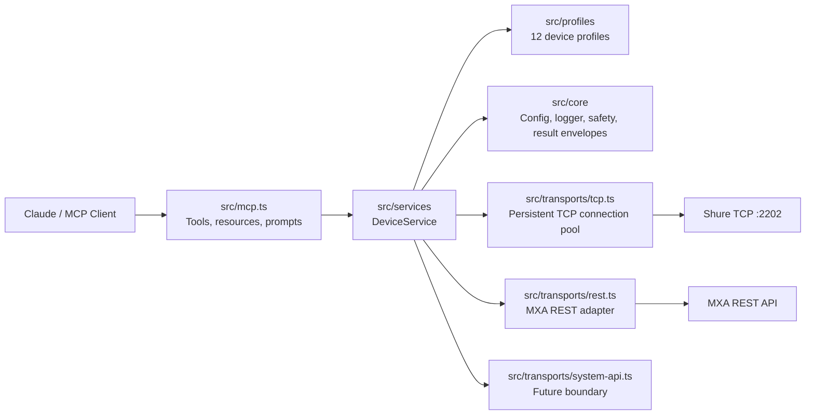

<p align="center">
  <a href="https://www.shure.com/">
    
  </a>
</p>

<h1 align="center">shure-mcp</h1>

<p align="center">
  <strong>Enterprise-grade local MCP server for guarded Shure installed-audio room operations, fleet monitoring, wireless management, and Dante network visibility.</strong>
</p>

<p align="center">
  <a href="#what-this-does">What It Does</a> |
  <a href="#quick-start">Quick Start</a> |
  <a href="#claude-integration">Claude Integration</a> |
  <a href="#configuration">Configuration</a> |
  <a href="#examples">Examples</a> |
  <a href="#mcp-surface">MCP Surface</a> |
  <a href="#safety-model">Safety</a>
</p>

> This project is not affiliated with, sponsored by, or endorsed by Shure Incorporated.
> The Shure logo and Shure product names are trademarks of Shure Incorporated and are used here only to identify the device ecosystem this MCP server interoperates with.

## What This Does

`shure-mcp` lets Claude, MCP Inspector, and other Model Context Protocol clients interact with configured Shure networked audio devices from a local machine that can reach the Shure Control network.

| Job | What it enables |
| --- | --- |
| Room operations | List rooms/devices, probe health, read status, mute/unmute, set gain, identify hardware, load presets, and inspect MXA talker positions. |
| Fleet monitoring | Parallel fleet health dashboard across all configured devices and rooms with per-device TCP/REST status, latency, firmware, and capability inventory. |
| Enterprise visibility | Per-channel audio metering, Dante/AES67 network status, and wireless receiver health (battery, RF frequency, signal strength) for QLX-D, ULX-D, and Axient Digital systems. |

It does not currently do network discovery, cloud brokering, user authentication, Shure Designer project management, or remote HTTPS MCP hosting.

## Why MCP For Shure Rooms?

MCP gives assistants a structured way to use real tools instead of guessing from documentation. For AV and IT teams, that means a Claude conversation can become a controlled room operations surface:

- "Show me a fleet health dashboard for every Shure device across all rooms."
- "What are the battery levels on the wireless mics in the auditorium?"
- "Is Dante enabled on the boardroom MXA920, and what IP is it using for audio?"
- "Mute the P300 automixer output while we troubleshoot the far-end echo."
- "Flash the ceiling array so the onsite tech can identify the right MXA920."
- "Check whether talker positions are available before I wire camera tracking logic."
- "Read peak audio levels on channels 1 through 4 of the conference room MXA710."

The server keeps configuration, host allowlisting, transport health, typed capabilities, and safety decisions in code instead of pushing those details into every prompt.

## Architecture



| Layer | Path | Responsibility |
| --- | --- | --- |
| Core | `src/core` | Config loading, structured logger, normalized types, operation results, safety policy. |
| Profiles | `src/profiles` | Device capability/profile resolution for 12 Shure device types. |
| Transports | `src/transports` | Persistent TCP connection pool, MXA REST transport, future System API interface. |
| Services | `src/services` | Device/room orchestration, fleet health, audio metering, Dante status, wireless status, REST/TCP fallback. |
| MCP | `src/mcp.ts` | Public tools, resources, prompts, and deprecated aliases. |
| Simulator | `src/simulator` | TCP (multi-command persistent) and REST simulators used by tests. |
| Shure protocol | `src/shure` | Low-level command builders, TCP client, and frame parser. |

## Supported Device Profiles

| Profile | Transport | Capabilities |
| --- | --- | --- |
| `MXA920` | REST first, TCP fallback | Status, mute, gain, identify, presets, talker positions, audio metering, Dante. |
| `MXA902` | REST first, TCP fallback | Status, mute, gain, identify, presets, talker positions, audio metering, Dante. |
| `MXA910` | TCP | Status, mute, gain, identify, presets, audio metering, Dante. |
| `MXA710` | REST first, TCP fallback | Status, mute, gain, identify, presets, talker positions, audio metering, Dante. |
| `MXA310` | TCP | Status, mute, gain, identify, presets, audio metering, Dante. |
| `P300` | TCP | Status, automixer/device/channel mute, gain, identify, presets, audio metering, Dante. |
| `QLXD4D` | TCP | All above + wireless (battery, RF frequency, signal strength). |
| `ULXD4D` | TCP | All above + wireless (battery, RF frequency, signal strength). |
| `ULXD4Q` | TCP | All above + wireless for up to 4 channels. |
| `AD600` | TCP | All above + wireless (battery, RF, interference). |
| `IntelliMix Room` | TCP | Status, mute, gain, identify, presets, audio metering, Dante. |
| `genericTcp` | TCP | Conservative TCP command-string operations shared by many Shure installed-audio devices. |

- MXA REST support depends on device firmware, settings, and the configured `restBaseUrl`.
- Use the Shure Control IP address, not an audio-only Dante address.
- Wireless capabilities require active transmitters to return meaningful values.

## Quick Start

Requirements: Node.js `>=20`, network reachability to the Shure Control IPs, and a JSON config file.

```bash
npm install
npm run build
cp examples/shure.config.example.json shure.config.local.json
# edit shure.config.local.json with real Control IP addresses
npm run typecheck && npm test
```

Inspect with MCP Inspector:

```bash
SHURE_CONFIG_PATH=/path/to/shure.config.local.json npm run inspect
```

Start the stdio server:

```bash
SHURE_CONFIG_PATH=/path/to/shure.config.local.json npm start
```

`npm start` launches a stdio MCP server and waits for an MCP client — it will look idle if run directly in a terminal.

## Claude Integration

See [docs/claude.md](docs/claude.md) for the full setup guide.

### Claude Desktop

Add to `~/Library/Application Support/Claude/claude_desktop_config.json` (macOS):

```json
{
  "mcpServers": {
    "shure": {
      "command": "node",
      "args": ["/path/to/shure-mcp/dist/index.js"],
      "env": {
        "SHURE_CONFIG_PATH": "/path/to/shure.config.local.json"
      }
    }
  }
}
```

Restart Claude Desktop and look for the `shure_*` tools.

### Claude Code

```bash
claude mcp add --transport stdio --scope local \
  --env SHURE_CONFIG_PATH=/path/to/shure.config.local.json \
  shure -- node /path/to/shure-mcp/dist/index.js
```

Verify with `claude mcp list`, then run `/mcp` inside Claude Code to confirm the server is connected.

### Claude Desktop MCPB Bundle

```bash
npm run mcpb:pack
```

This creates `shure-mcp.mcpb`. Install it in Claude Desktop via Settings → Extensions → Advanced settings → Install Extension. Enter the absolute path to your Shure config JSON when prompted.

The generated MCPB is unsigned by default, which is normal for local/internal testing.

### Optional Claude Skill

`skills/shure-av-operator/SKILL.md` is a workflow playbook that teaches Claude safe Shure room-operation behavior on top of the MCP tools. Package it with `npm run skill:pack` and upload the resulting ZIP wherever your Claude environment supports custom skills.

## Configuration

Point `SHURE_CONFIG_PATH` at a JSON file:

```json
{
  "devices": [
    {
      "id": "boardroom-mxa920",
      "name": "Boardroom MXA920",
      "host": "192.168.1.50",
      "model": "MXA920",
      "room": "boardroom",
      "tags": ["ceiling-array", "camera-tracking"],
      "preferredApi": "auto",
      "tcpPort": 2202,
      "restBaseUrl": "https://192.168.1.50",
      "tls": "insecure"
    },
    {
      "id": "boardroom-p300",
      "name": "Boardroom P300",
      "host": "192.168.1.51",
      "model": "P300",
      "room": "boardroom",
      "tags": ["processor"],
      "preferredApi": "tcp",
      "tcpPort": 2202,
      "tls": "verify"
    }
  ],
  "rooms": [
    {
      "id": "boardroom",
      "name": "Boardroom",
      "deviceIds": ["boardroom-mxa920", "boardroom-p300"],
      "tags": ["zoom-room"]
    }
  ],
  "allowedHosts": ["192.168.1.50", "192.168.1.51"],
  "safety": {
    "allowRawSet": false,
    "allowDestructive": false,
    "allowUnknownMutatingCommands": false
  },
  "timeouts": { "tcpMs": 2000, "restMs": 2500, "idleMs": 150 },
  "logging": { "level": "info" }
}
```

See `examples/shure.config.example.json` for a seven-device, three-room example covering MXA920, P300, MXA710, MXA910, QLXD4D, and ULXD4Q.

### Device fields

| Field | Required | Notes |
| --- | --- | --- |
| `id` | Recommended | Stable identifier used in tool calls. Generated from name if omitted. |
| `name` | Recommended | Human-readable label. |
| `host` | Yes | Shure Control IP or hostname. Must be in `allowedHosts` when that list is set. |
| `model` | No | Profile hint before probing. Known values: `MXA920`, `MXA902`, `MXA910`, `MXA310`, `MXA710`, `P300`, `QLXD4D`, `ULXD4D`, `ULXD4Q`, `AD600`, `IntelliMixRoom`. |
| `room` | No | Room grouping. Rooms can also be declared explicitly in the `rooms` array. |
| `tags` | No | Operator metadata: `processor`, `camera-tracking`, `wireless`, etc. |
| `preferredApi` | No | `auto`, `rest`, or `tcp`. Defaults to `auto`. |
| `tcpPort` | No | Defaults to `2202`. |
| `restBaseUrl` | MXA REST only | e.g. `https://192.168.1.50`. Required for REST operations on MXA devices. |
| `tls` | No | `verify` or `insecure`. Use `insecure` only on trusted control networks with self-signed certs. |

### Environment variables

| Variable | Purpose |
| --- | --- |
| `SHURE_CONFIG_PATH` | JSON config file path (preferred). |
| `SHURE_DEVICES` | Legacy JSON array of devices. |
| `SHURE_DEFAULT_HOST` | Creates a single default device when no device list is configured. |
| `SHURE_DEFAULT_PORT` | TCP port override. Defaults to `2202`. |
| `SHURE_ALLOWED_HOSTS` | Comma-separated host allowlist. |
| `SHURE_TIMEOUT_MS` | TCP command timeout in ms. |
| `SHURE_REST_TIMEOUT_MS` | REST timeout in ms. |
| `SHURE_IDLE_MS` | TCP response idle window in ms. |
| `SHURE_ALLOW_RAW_SET` | Allow known-safe raw `SET` command strings. |
| `SHURE_ALLOW_DESTRUCTIVE` | Allow destructive operations (reboot/reset). Default: blocked. |
| `SHURE_ALLOW_UNKNOWN_MUTATING_COMMANDS` | Allow unknown raw mutating commands. Default: blocked. |

## Examples

### Fleet Health Dashboard

```json
{ "tool": "shure_fleet_health", "arguments": {} }
```

```json
{
  "ok": true,
  "summary": "All 7 devices online.",
  "onlineCount": 7,
  "degradedCount": 0,
  "offlineCount": 0,
  "totalCount": 7,
  "durationMs": 312,
  "devices": [
    {
      "id": "boardroom-mxa920",
      "name": "Boardroom MXA920",
      "model": "MXA920",
      "room": "boardroom",
      "status": "online",
      "tcpOk": true,
      "restOk": true,
      "tcpLatencyMs": 18,
      "restLatencyMs": 42,
      "firmwareVersion": "6.6.1",
      "warnings": []
    }
  ],
  "rooms": [
    { "id": "boardroom", "name": "Boardroom", "allOnline": true, "deviceIds": ["boardroom-mxa920", "boardroom-p300"] }
  ]
}
```

### Wireless Battery and RF Status

```json
{ "tool": "shure_get_wireless_status", "arguments": { "deviceId": "auditorium-ulxd4q", "channel": 1 } }
```

```json
{
  "ok": true,
  "data": {
    "channel": 1,
    "batteryCharge": "85",
    "rfFrequency": "655600",
    "rfPower": "NORMAL",
    "rfSignalStrength": "80",
    "transmitterType": "ULXD2"
  }
}
```

### Dante Network Status

```json
{ "tool": "shure_get_dante_status", "arguments": { "deviceId": "boardroom-mxa920" } }
```

```json
{
  "ok": true,
  "data": {
    "danteEnabled": "ON",
    "danteDeviceName": "MXA920-Boardroom",
    "danteAes67": "OFF",
    "audioIpAddr": "169.254.1.50",
    "audioSubnetMask": "255.255.0.0",
    "audioGateway": "0.0.0.0",
    "controlMacAddr": "AA:BB:CC:DD:EE:FF"
  }
}
```

### Peak Audio Levels

```json
{ "tool": "shure_get_audio_levels", "arguments": { "deviceId": "boardroom-mxa920", "channels": [1, 2, 3, 4] } }
```

```json
{
  "ok": true,
  "data": {
    "levels": [
      { "channel": 1, "rawLevel": "-300", "peakDb": -30.0 },
      { "channel": 2, "rawLevel": "-480", "peakDb": -48.0 },
      { "channel": 3, "rawLevel": "-600", "peakDb": -60.0 },
      { "channel": 4, "rawLevel": "-600", "peakDb": -60.0 }
    ]
  }
}
```

### Other common operations

```json
{ "tool": "shure_list_devices", "arguments": {} }
{ "tool": "shure_probe_device", "arguments": { "deviceId": "boardroom-mxa920" } }
{ "tool": "shure_get_room_status", "arguments": { "roomId": "boardroom" } }
{ "tool": "shure_set_mute", "arguments": { "deviceId": "boardroom-p300", "target": "automixer", "state": "ON" } }
{ "tool": "shure_set_gain", "arguments": { "deviceId": "boardroom-p300", "target": "channel", "index": 1, "gainDb": -6 } }
{ "tool": "shure_identify_device", "arguments": { "deviceId": "boardroom-mxa920", "state": "ON" } }
{ "tool": "shure_load_preset", "arguments": { "deviceId": "boardroom-mxa920", "preset": 2 } }
{ "tool": "shure_send_tcp_command", "arguments": { "deviceId": "boardroom-p300", "command": "< GET DEVICE_ID >" } }
```

For `automixer` mute, the implementation defaults to Shure channel index `21` when no index is provided. `shure_set_gain` converts dB to Shure's raw high-resolution gain value. Raw `GET` commands are allowed by default; raw `SET` and destructive commands are blocked by safety policy.

## MCP Surface

### Tools

| Tool | Read/write | Purpose |
| --- | --- | --- |
| `shure_list_devices` | Read | List configured devices, rooms, profiles, and safety posture. |
| `shure_probe_device` | Read | Probe TCP/REST health, profile selection, model, firmware, and capabilities. |
| `shure_get_device_status` | Read | Normalized status for one configured device. |
| `shure_get_room_status` | Read | Normalized status for all devices in one room. |
| `shure_fleet_health` | Read | Parallel probe of all devices — fleet health dashboard with per-room summary. |
| `shure_get_audio_levels` | Read | Peak dBFS metering across specified channels via `AUDIO_IN_PEAK_LEVEL`. |
| `shure_get_dante_status` | Read | Dante/AES67 network status: enabled, device name, IP addressing, AES67 mode. |
| `shure_get_wireless_status` | Read | Wireless receiver health: battery %, RF frequency, signal strength, TX type. |
| `shure_get_talker_positions` | Read | Active talker positions from MXA REST-capable devices. |
| `shure_set_mute` | Write | Mute, unmute, or toggle device/channel/automixer/coverage-area targets. |
| `shure_set_gain` | Write | Set channel or coverage-area gain in dB. |
| `shure_identify_device` | Write | Turn the device identify/flash indicator on or off. |
| `shure_load_preset` | Write | Load preset 1–10. |
| `shure_send_tcp_command` | Guarded raw | Send a documented Shure TCP command string through the safety policy. |

Deprecated compatibility aliases (kept for one release): `shure_list_configured_devices`, `shure_send_command`, `shure_get_device_info`, `shure_get_mute`, `shure_get_audio_gain`, `shure_set_audio_gain`.

### Resources

| Resource | Purpose |
| --- | --- |
| `shure://devices` | Configured device inventory and profile summaries. |
| `shure://rooms/{roomId}` | Configured room definition. |
| `shure://devices/{deviceId}/capabilities` | Profile-derived device capabilities. |
| `shure://profiles/{model}` | Built-in profile metadata. |

### Prompts

| Prompt | Purpose |
| --- | --- |
| `shure_room_health_check` | Guide an operator through a room health review. |
| `shure_mute_sync_diagnosis` | Diagnose mute sync across processors, microphones, and conferencing software. |
| `shure_camera_tracking_setup` | Assess MXA talker-position and camera-tracking readiness. |
| `shure_safe_tcp_command` | Evaluate and run a documented TCP command through guardrails. |
| `shure_fleet_briefing` | Executive-ready fleet health briefing across all rooms. |
| `shure_wireless_readiness` | Pre-event battery and RF readiness check across all wireless receivers. |

## Safety Model

Reads are always available for configured, allowlisted devices. Typed writes (mute, gain, identify, preset load) are available for normal operator use. Raw TCP command strings are guarded:

- Raw `GET` — allowed by default.
- Raw `SET` — blocked unless `allowRawSet` is enabled.
- Destructive commands (`REBOOT`, `DEFAULT_SETTINGS`, reset variants) — blocked unless `allowDestructive` is enabled.
- Unknown raw mutating commands — blocked unless `allowUnknownMutatingCommands` is enabled.

Every operation result carries `ok`, `operation`, `deviceId`, `transport`, `durationMs`, parsed TCP frames (where applicable), `warnings`, `remediation` hints, and an `error` object on failure.

Example blocked raw command:

```json
{
  "ok": false,
  "operation": "rawTcp.write",
  "error": {
    "code": "SAFETY_BLOCKED",
    "message": "Raw SET commands are blocked by guarded write policy. Use typed tools or enable allowRawSet."
  },
  "remediation": ["Use typed tools for guarded writes or explicitly enable raw SET/destructive policy in config."]
}
```

## Transport Behavior

**TCP** connects to the configured host and port (default `2202`). A persistent socket pool keeps one connection open per device, reused across serial commands with a 30-second idle timeout. Commands are serialized per device so no two commands race on the same socket. No-acknowledgement commands are supported via `waitForResponse: false`.

**REST** is used for MXA profiles when `preferredApi` is `auto` or `rest` and `restBaseUrl` is configured. It normalizes status, mute, preset, and talker-position responses and falls back to TCP for unsupported operations. Use `tls: "insecure"` on trusted control networks with self-signed device certificates.

**Logging** writes newline-delimited JSON to `stderr`: `{ "ts": "...", "level": "info", "msg": "..." }`. Configure the level (`silent` / `error` / `warn` / `info` / `debug`) via `logging.level` in the config file.

## Development

```bash
npm run build       # compile TypeScript
npm run typecheck   # type-check without emitting
npm test            # build + run all tests
npm audit --omit=dev
npm run inspect     # MCP Inspector
npm run mcpb:pack   # build + validate + pack MCPB bundle
npm run skill:pack  # validate + zip the AV operator skill
```

Test coverage includes config loading, host allowlisting, safety policy, 12-profile selection, TCP frame parsing, no-acknowledgement commands, dB conversion, REST normalization, simulator-backed probing and persistent-connection multi-command sessions, and MCP discovery.

## Troubleshooting

| Symptom | Likely cause | Fix |
| --- | --- | --- |
| Claude does not show `shure_*` tools | Server not configured, not built, or Claude Desktop not restarted. | Run `npm run build`, verify the `dist/index.js` path, restart Claude. |
| `Host ... is not in allowedHosts` | Config host not allowlisted. | Add the exact host/IP to `allowedHosts` or `SHURE_ALLOWED_HOSTS`. |
| TCP probe times out | Wrong IP, firewall, wrong VLAN, device offline, or Dante-only IP. | Use the Shure Control IP and confirm port `2202` reachability. |
| REST probe fails but TCP works | REST not enabled, missing `restBaseUrl`, cert issue, or old firmware. | Configure `restBaseUrl`, check device settings, use `tls: "insecure"` on trusted networks if needed. |
| Raw command is blocked | Safety policy working as intended. | Use typed tools. Enable raw mutating commands only for trusted operators. |
| Wireless status returns all undefined | No active transmitters, or device doesn't support wireless TCP params. | Power on transmitters and confirm this is a QLX-D, ULX-D, or Axient Digital receiver. |
| `node dist/index.js` appears to hang | Stdio MCP servers wait for an MCP client. | Connect via Claude, MCP Inspector, or an SDK client. |

## Roadmap

- Harden MXA REST endpoint mapping against real-device fixtures from multiple firmware versions.
- Add TCP `SAMPLE` subscription support for push-based audio metering and talker-position streams.
- Add optional Streamable HTTP transport for hosted/internal service deployments.
- Add authenticated enterprise fleet workflows through the `SystemApiTransport` boundary (Shure System API Server).
- Add richer room-level policy: write windows, role-based command categories, and audit logging.

## References

- [Shure command strings](https://www.shure.com/en-US/docs/commandstrings/)
- [MXA920 command strings](https://www.shure.com/en-US/docs/commandstrings/MXA920/)
- [P300 command strings](https://www.shure.com/en-US/docs/commandstrings/P300/)
- [Shure REST API hub](https://shure.stoplight.io/)
- [Model Context Protocol overview](https://modelcontextprotocol.io/docs/getting-started/intro)
- [MCP Inspector](https://modelcontextprotocol.io/docs/tools/inspector)
- [Claude MCPB packaging](https://claude.com/docs/connectors/building/mcpb)
- [Claude custom skills](https://claude.com/docs/skills/how-to)
